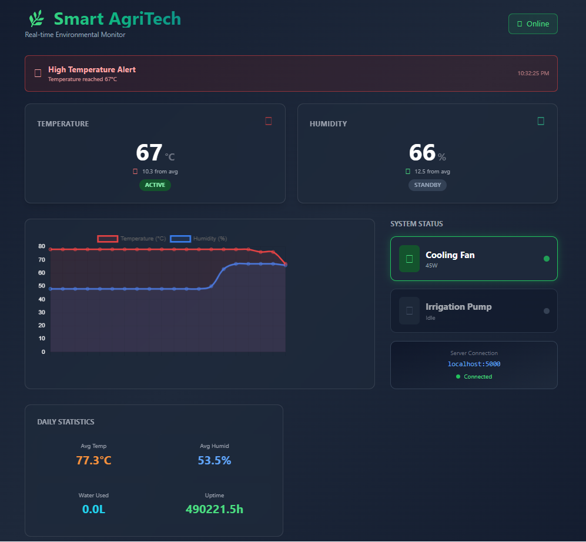
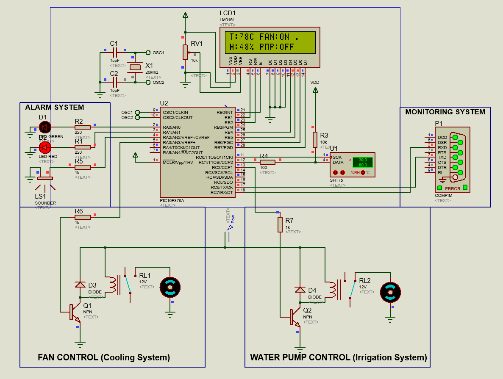

# 🌿 AgriTech Smart Greenhouse Controller


## 📖 Overview

**AgriTech Smart Greenhouse Controller** is a comprehensive embedded system designed to automate environmental monitoring and control for greenhouses. It combines a robust **PIC microcontroller-based** hardware layer with a modern **Python/Flask** web dashboard for real-time visualization and data logging.

The system continuously monitors temperature and humidity, automatically actuating fans and pumps to maintain optimal growing conditions.

## ✨ Key Features

### 🎮 Embedded Control (PIC16F877A)
- **Real-time Monitoring**: High-precision temperature and humidity readings using the **SHT75** sensor.
- **Automatic Actuation**:
  - **Cooling Fan**: Activates when temperature exceeds **30°C**.
  - **Irrigation Pump**: Activates when humidity drops below **40%**.
- **Local Interface**: 16x2 LCD display showing live metrics and device status.
- **Safety System**: Visual (LED) and Audio (Buzzer) alarms for critical environmental deviations.

### 💻 Web Dashboard (Python/Flask)

- **Live Visualization**: Beautiful, responsive dashboard built with **React** and **Tailwind CSS**.
- **Real-time Charts**: Dynamic charts tracking temperature and humidity trends over time.
- **System Status**: Visual indicators for Fan and Pump operation.
- **Data Logging**: Automatic logging of all sensor data to CSV for historical analysis.
- **Alerts**: Instant UI alerts for high temperature or low humidity events.

## 🛠️ Technology Stack

### Hardware
- **Microcontroller**: PIC16F877A (or compatible)
- **Sensor**: SHT75 (Temperature & Humidity)
- **Actuators**: 5V Relays (for Fan & Pump)
- **Display**: 16x2 LCD (HD44780 controller)
- **Communication**: UART (Serial) to PC

### Software
- **Firmware**: C (XC8 Compiler)
- **Backend**: Python 3, Flask, PySerial
- **Frontend**: HTML5, Tailwind CSS, React (CDN), Chart.js
- **Tools**: MPLAB X IDE, Proteus (Simulation)

## 🚀 Installation & Setup

### 1. Firmware Setup
1. Open the project in **MPLAB X IDE**.
2. Compile `main.c` using the **XC8 Compiler**.
3. Flash the generated `.hex` file to your PIC microcontroller using a programmer (e.g., PICkit 3).

### 2. Python Environment
Ensure you have Python 3.x installed. Install the required dependencies:

```bash
pip install flask pyserial flask-cors
```

### 3. Hardware Connection
Connect the hardware components as defined in `main.c`:

| Component | PIC Pin | Description |
|-----------|---------|-------------|
| **SHT75 Data** | RC1 | Sensor Data |
| **SHT75 Clk** | RC0 | Sensor Clock |
| **Fan Relay** | RA3 | Control Pin |
| **Pump Relay** | RC2 | Control Pin |
| **LCD RS** | RB1 | Display Control |
| **LCD EN** | RB0 | Display Control |
| **UART TX** | RC6 | Serial Transmit |
| **UART RX** | RC7 | Serial Receive |



> [!IMPORTANT]
> Ensure your PC is connected to the PIC's UART pins via a USB-TTL converter or RS232 level shifter. Update the `SERIAL_PORT` in `server.py` to match your system (e.g., `COM3` or `/dev/ttyUSB0`).

## 🖥️ Usage

1. **Power on the Hardware**: The LCD should initialize and show current readings.
2. **Start the Server**:
   Navigate to the `AgriTech Monitor` directory and run:
   ```bash
   python server.py
   ```
3. **Access Dashboard**:
   Open your browser and go to:
   `http://localhost:5000`

## 📂 Project Structure

```
AgriTech/
├── main.c                  # PIC Firmware Source Code
├── AgriTech.X.production.hex # Compiled Firmware
├── AgrtiTech_logs.csv      # Data Logs
├── AgriTech Monitor/       # Web Application
│   ├── server.py           # Flask Backend & Serial Handler
│   └── Templates/
│       └── index.html      # Frontend Dashboard
└── README.md               # Project Documentation
```

## 🤝 Contributing
Contributions are welcome! Please fork the repository and submit a pull request.

## 📄 License
This project is open-source and available under the [MIT License](LICENSE).
